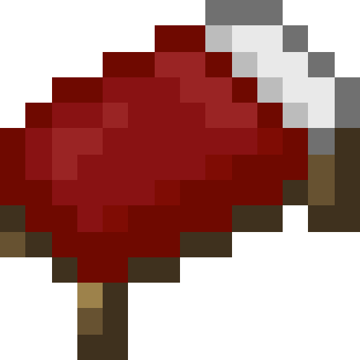

  <h1> BedWars 🛏️ </h1>
	
	
A BedWars plugin for PocketMine-MP servers

	
	

## What is BedWars
BedWars is a PvP minigame where players have to protect their bed from being destroyed by other players. After the bed is destroyed, the player can no longer respawn. The last team standing wins the game.

## Features
- 🎮 Solos, Duos & Squads
- 👁️ Spectator mode
- 🗺️ Easy map creation
- 💰 Upgrades & Shops
- 📂 SQLite3 provider support
- 🐬 MySQL provider support
- 🗃️ Efficient Storage and Retrieval of Player Data
- 🌟 And more!

## Getting Started
These instructions will get you a copy of the project up and running on your server.

### Downloading
Currently, the plugin is being reviewed by Poggit. You can download the latest version [here](https://github.com/Sergittos/BedWars/releases/latest).

### Installing
1. Download the plugin and drop it inside your PocketMine's plugins folder, then restart your server.
2. Then, join your server and run ``/bedwars``, this command will show you a form where you can create and manage maps.

- You can see an example of how to create maps in the following video or [here](https://youtu.be/BdP5b9C4yqA).

## Donating
If you've found value in my open-source work, please consider contributing. Your donation empowers me to enhance existing projects and develop new ones for the community's benefit.

- [Ko-fi](https://ko-fi.com/sergittos)
- [PayPal](https://paypal.me/sergittos)

## Virions Used
- [EasyUI](https://github.com/dresnite/easyui) by **dresnite**

## License
This project is licensed under the GNU LESSER GENERAL PUBLIC [LICENSE](LICENSE) - see the LICENSE file for details
